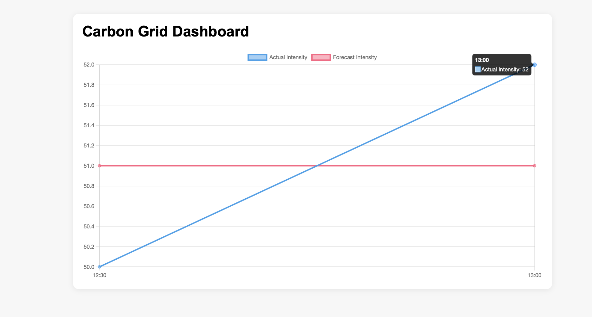

Carbon Grid
## Dashboard Preview

Carbon Grid is a backend platform built with Django for ingesting, storing and analysing carbon intensity data.

The project demonstrates how external environmental data can be collected, processed asynchronously and exposed through APIs and dashboards.

The system retrieves carbon intensity data from an external API, validates and stores it in a relational database, and provides endpoints for querying records, generating reports and visualising trends.

The architecture focuses on common backend patterns used in real production systems such as background processing, scheduled jobs, rate limiting, logging and containerisation.

⸻

Overview

Many modern backend systems integrate with external data sources, process incoming data asynchronously and expose structured information through APIs.

Carbon Grid is a simplified example of such a system.

The application periodically retrieves carbon intensity data from an external API, stores it in a database and allows users to explore the data through API endpoints and a lightweight dashboard.

The goal of this project is to demonstrate how backend services can be structured when working with external data pipelines.

⸻

Core Capabilities

The platform provides the following capabilities:

• Integration with an external carbon intensity API
• Data ingestion pipeline with validation and normalisation
• Relational data storage for carbon records and regions
• REST API endpoints for retrieving stored data
• Dashboard endpoint summarising key metrics
• Background task processing using Celery workers
• Redis-based message queue for asynchronous task execution
• Scheduled ingestion jobs using Celery Beat
• Asynchronous report generation workflow
• Email notification after report generation
• Rate limiting for sensitive API endpoints
• Structured logging for observability and debugging
• Containerisation support through Docker

⸻

Technology Stack

The project uses the following technologies:

Python
Django
Django REST Framework
Celery
Redis
django-celery-beat
django-celery-results
Chart.js (dashboard visualisation)
Docker

⸻

System Architecture

The application follows a typical architecture used in data ingestion platforms.

External carbon intensity data is retrieved from an API and processed asynchronously before being stored and exposed through internal APIs.

Data flow:

External Carbon API
↓
Django API endpoint
↓
Celery task queue (Redis)
↓
Celery worker processes the task
↓
Data validation and normalisation
↓
Database storage
↓
API endpoints and dashboard visualisation
↓
Report generation and email notification

⸻

Data Ingestion Pipeline

The ingestion pipeline retrieves carbon intensity data and converts it into structured database records.

Workflow:
	1.	A request triggers the ingestion endpoint.
	2.	The endpoint sends a background task to Celery.
	3.	Redis queues the task.
	4.	A Celery worker processes the task asynchronously.
	5.	Data is validated and saved to the database.
	6.	Logs are written for monitoring and debugging.

This architecture prevents long-running operations from blocking the main API server.

⸻

Asynchronous Task Processing

Background tasks are handled using Celery workers.

Tasks currently include:

• Carbon intensity ingestion
• Report generation
• Email delivery after report completion

Using Celery ensures that time-consuming operations run outside the request lifecycle, allowing the API to remain responsive.

⸻

Scheduled Jobs

Data ingestion can also run automatically using Celery Beat.

A scheduled job periodically retrieves carbon intensity data and stores it in the database, allowing the system to build a historical dataset over time.

⸻

API Endpoints

The application exposes several REST endpoints.

Ingest carbon intensity data:

POST
/api/ingest/

Retrieve stored records:

GET
/api/records/

Retrieve aggregated dashboard summary:

GET
/api/dashboard-summary/

Generate a report:

POST
/api/reports/generate/

⸻

Dashboard

A simple dashboard is included for visualising carbon intensity trends.

The dashboard displays recent data points using a line chart comparing:

• Forecast carbon intensity
• Actual carbon intensity

The chart is rendered using Chart.js.

⸻

Rate Limiting

Rate limiting is applied to sensitive endpoints to prevent abuse and reduce system load.

Examples include:

• Data ingestion endpoint
• Report generation endpoint

This helps maintain API stability under repeated requests.

⸻

Logging

Structured logging is implemented for the ingestion pipeline.

Logs capture events such as:

• start of the ingestion process
• number of records saved
• individual record processing

Logs are written both to the console and to a file located at:

logs/app.log

⸻

Running the Project Locally

Clone the repository and install dependencies.

Install dependencies:

pip install -r requirements.txt

Run Django:

python manage.py runserver

Start Redis:

redis-server

Start Celery worker:

celery -A config worker -l info

Start Celery Beat scheduler:

celery -A config beat -l info

The application will be available at:

http://127.0.0.1:8000

Dashboard:

http://127.0.0.1:8000/api/dashboard/

⸻

Running with Docker

Build the container image:

docker build -t carbon-grid .

Run the container:

docker run -p 8000:8000 carbon-grid

The application will then be accessible on port 8000.

⸻

Project Structure

The repository is organised to keep application logic modular and easy to navigate.

carbon-grid/

config/                 Django project configuration

core/                   Main application
    models.py           Database models
    views.py            API views and dashboard views
    urls.py             Application routes
    tasks.py            Celery background tasks
    services/           Data ingestion and reporting services
    migrations/

templates/              Dashboard HTML templates

logs/                   Application logs

requirements.txt        Python dependencies
Dockerfile              Container configuration
README.md               Project documentation

⸻

Development Notes

This project was intentionally designed to reflect backend engineering practices commonly used in production systems.

Important design considerations include:

• separating ingestion logic from API endpoints
• delegating long-running tasks to background workers
• scheduling recurring ingestion tasks
• maintaining structured logs for observability
• applying rate limiting to protect the API

These patterns are widely used in systems that integrate external data sources and process asynchronous workflows.

⸻

Possible Extensions

Future improvements could include:

• production database configuration
• horizontally scaled worker infrastructure
• authentication and user management
• advanced analytics on carbon intensity data
• improved dashboard visualisations
• production email services (SendGrid, AWS SES)
• API documentation using OpenAPI / Swagger
• monitoring and metrics integration

⸻

Author

Mo Mirzaei
